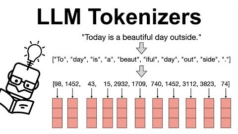
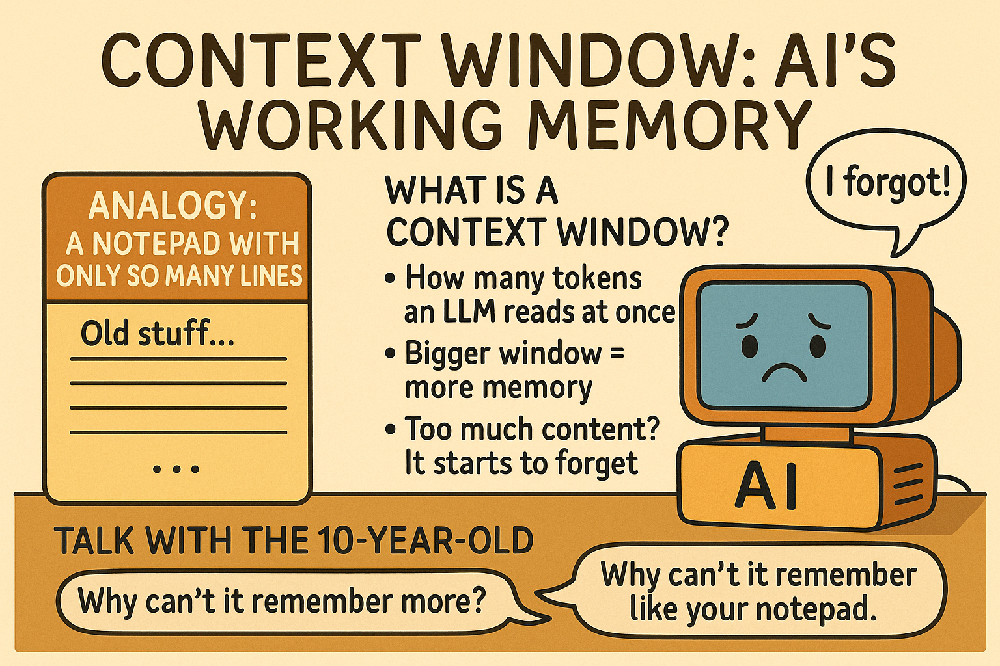

# Stop Burning Tokens — an AI Coding Agent Runbook

## DevOps Toronto Demo Session

> **Note:** This session is **agent-agnostic** — the ideas apply to any AI coding
> agent (Claude Code, Cursor, Windsurf, Codex, Gemini CLI, …). The presenter
> demos in **GitHub Copilot** (VS Code), so live commands are shown Copilot-first
> with each agent's equivalent noted alongside. Nothing here is Copilot-only.

A single, copy-paste demo that tells one story in three acts, each attacking a
different source of wasted tokens:

1. **Token optimization techniques** — the slash commands, context habits, and
   config files your agent already ships (grounded in GitHub's official guide).
2. **Spec Kit** — build the *right* thing once instead of re-prompting your way
   there (the biggest hidden token cost is rework).
3. **Two tools** — **ponytail** shrinks the *code* the agent writes, **caveman**
   shrinks the *text* it writes.

**Event:** [DevOps Toronto Meetup - July 30, 2026](https://www.meetup.com/devopsto/events/315582119/)
**Duration:** ~30 minutes · **Demoed on:** GitHub Copilot (VS Code) · **Applies to:** any agent

---

## ⭐ Scan for this repo

Grab the runbook, demos, and instruction files on your phone or laptop.

<p align="center">
  
</p>

---

## About me

<p align="center">
  
</p>

**Kaan Turgut** — Cloud Solution Architect · Microsoft AI Foundry MVP · Cloud,
DevOps & AI Engineer · community speaker & contributor.
Find me: [LinkedIn](https://www.linkedin.com/in/hkaanturgut) ·
[GitHub](https://github.com/hkaanturgut) ·
[YouTube](https://www.youtube.com/@hkaanturgut) · X [@hkaanturgut](https://x.com/hkaanturgut)

---

## 📲 Scan to start — 60-second audience survey

Before we dive in, scan this and tell us how you use AI agents. It shapes the
room and the demo.

<p align="center">
  
</p>

---


## Start here: why tokens are the whole game

Before any optimization, understand what you're actually paying for.

### Tokens — the unit of everything

An LLM doesn't read characters or words; it reads **tokens**. A token is a chunk
of text — roughly **¾ of a word**, or about **4 characters** in English. "Stop
burning tokens" is ~4 tokens. Code and punctuation tokenize denser, so a file is
more tokens than its word count suggests.

Rule of thumb: **1,000 tokens ≈ 750 words ≈ ~50 lines of code.**

#### How an LLM tokenizer works

<p align="center">
  
</p>

The model never sees your text — it sees numbers. Three steps:

1. **Split into tokens.** A tokenizer (e.g. BPE — byte-pair encoding) breaks text
   into common sub-word chunks. Frequent words stay whole; rarer ones fragment.
   Above, *"Today is a beautiful day outside."* becomes
   `["To","day","is","a","beaut","iful","day","out","side","."]` — note
   `beautiful` → `beaut` + `iful`, and the period is its own token.
2. **Map to token IDs.** Each token is looked up in a fixed vocabulary and
   replaced by an integer (`98, 1452, 43, …`). Same chunk → same ID every time.
3. **Embed as vectors.** Each ID becomes a learned vector (the columns) that the
   model actually computes on.

Why it matters for cost:
- **Billing counts tokens, not characters or words** — steps 1–2 are exactly what
  you pay for, on input *and* output.
- **Sub-word splitting is why code costs more.** Identifiers, punctuation,
  whitespace, and JSON all fragment into many tokens, so a file is more tokens
  than its word count suggests.
- **Every turn re-tokenizes the whole conversation** — which is why trimming
  context (Act 1) directly cuts the bill.

#### The integer ID is *not* the token count

A common mix-up: the integer is **which** token, the count is **how many**.
Neither is arithmetic — both are lookups.

- **The vocabulary is a frozen dictionary** (~50K–200K entries) built once via BPE
  training: start from raw bytes/characters, repeatedly merge the most *frequent*
  adjacent pair into a new entry. Common words survive whole (`day`); rare ones
  stay split (`beautiful` → `beaut`+`iful`).
- **A token ID is just the row number** in that dictionary — `day → 1452` means
  "row 1452", not "1452 of something". Same chunk → same ID, always.
- **The token count is simply how many chunks your text splits into** — literally
  `len(ids)`. The integer *values* are never summed.

```
"Today is a beautiful day outside."
  → ["To","day","is","a","beaut","iful","day","out","side","."]   (split)
  → [98, 1452, 43, 15, 2932, 1709, 1452, 3112, 3823, 74]          (lookup IDs)
  → token count = length of that list = 10
```

So you can't predict the count from word count: a common word is 1 token, a long
identifier can be 5+, and spaces/newlines/punctuation are their own tokens — which
is exactly why code costs more than prose.

> Try it: paste text into a live tokenizer (e.g. platform tokenizer tools) and
> watch the token count jump on code and rare words.

### Token-based pricing — you pay per token, twice

APIs bill **per million tokens (MTok)**, and **input and output are priced
separately** — output is usually **3–5× more expensive** than input, because the
model generates it one token at a time. Illustrative (check current vendor
pricing — these move):

| Model tier | Input / MTok | Output / MTok |
|------------|-------------|---------------|
| Small/fast | ~$0.25–1 | ~$1–5 |
| Frontier | ~$3–15 | ~$15–75 |

Two levers fall straight out of this table:
- **Input tokens** = everything you *send* (system prompt, tools, history, files).
  → attacked by Act 1 (context) and Act 2 (less rework).
- **Output tokens** = everything the model *writes back* (explanations + code).
  → attacked by Act 3 (caveman trims prose, ponytail trims code).

### The context window — the hard ceiling

The **context window** is the maximum number of tokens a model can consider at
once — **input + output combined**. Typical sizes today: ~128K, 200K, up to 1M+
tokens.

<p align="center">
  
</p>

Two things people miss:
1. **Every turn re-sends the whole conversation.** The model is stateless, so on
   turn 20 you pay input tokens for turns 1–19 *again*. A long chat silently
   re-bills its entire history on every message.
2. **Fill the window and quality drops.** As you approach the limit the agent
   truncates or "forgets" earlier context, and models get less reliable in a very
   full window ("lost in the middle"). Cost goes up *and* accuracy goes down.

> **Say:** "You're not billed once for a conversation — you're billed for the
> whole conversation on every single turn. That's why context hygiene is money."

---

## The story in one picture

Four ways tokens leak, and what plugs each:

| Leak | What it is | Act |
|------|-----------|-----|
| **Context** | Stale conversation re-sent every turn | Act 1 — context, prompts, cache, model |
| **Rework** | Building the wrong thing, then redoing it | Act 2 — Spec Kit |
| **Code** | The agent over-building what you asked for | Act 3 — ponytail |
| **Output** | Verbose replies on every turn | Act 3 — caveman |

Native gets you far for free. Spec Kit kills the expensive rework loop. The two
tools make the last two leaks automatic.

---

## Prerequisites

- Any AI coding agent. The presenter uses **GitHub Copilot** + **Copilot Chat**
  in VS Code, signed in, with this repo open as the workspace folder.
- Copilot only: instruction files enabled (usually on by default) — Settings →
  search **"copilot instruction files"** → *Use Instruction Files*, or in
  `.vscode/settings.json`:
  ```json
  { "github.copilot.chat.codeGeneration.useInstructionFiles": true }
  ```
- For Act 2: [uv](https://docs.astral.sh/uv/), Python 3.11+, and Git.
- Run the code demos in your agent's **agent/edit** mode.

---

# Act 1 — Token Optimization Techniques (no installs)

Everything the agent *reads* and *does* costs tokens. These are the techniques
that cut that cost with zero installs — grouped into **context & prompts** and
**model, cache & workflow**. Commands are shown Copilot-first; Claude Code and
others have close equivalents. Grounded in GitHub's
[Optimize your AI usage](https://docs.github.com/en/copilot/tutorials/optimize-ai-usage) guide.

## A. Context & prompt management

**Treat context as a budget.** Open tabs, attached files, and the whole
conversation are re-sent as input tokens *every turn*. Watch it with the
context-window indicator (Copilot Chat) or `/context` (Copilot CLI / Claude Code).

**Reset or compact — don't let threads sprawl:**

| Goal | Command |
|------|---------|
| New, unrelated task — drop history | `/clear` (Copilot CLI: `/new`) |
| Keep the thread, shrink it | `/compact` — optionally `/compact focus on auth` |
| Check current usage | `/context` |

> Highest-leverage habit in the talk: `/clear` between unrelated tasks. Free, and
> nobody does it.

**Progressive disclosure — point, don't paste.** Don't dump a codebase or a huge
log. Give the agent a *map* (`.github/copilot-instructions.md` / `AGENTS.md`) and
let it open only what it needs. Pre-filter big data locally and paste only the
result:

```bash
wc -l demo/sample-data/large-log.txt        # ~500,000 lines
grep -iE "error|fatal|exception" demo/sample-data/large-log.txt \
  | sort | uniq -c | sort -rn | head        # → a few lines: Postgres timeout
```
> Prompt with only the grep output: *"Top error lines below — most likely root
> cause and smallest fix?"* Same answer, ~99% fewer tokens. Local `grep` is free.

**Be precise, not polite.** Drop pleasantries; give the agent three things —
a clear task, the relevant context up front, and a **stopping condition**. Vague
prompts cause exploration, retries, and scope drift (all tokens).

**Trim shell & tool outputs.** Pipe noisy commands through `grep`/`head`/`jq` so
the agent ingests errors, not raw dumps.

**Bring only the tools you need.** A full MCP server's toolset is re-sent every
request — enable only the toolsets the task needs.

## B. Model, cache & workflow

**Match the model to the task.** Reasoning models for architecture/hard debugging;
mid-tier to execute a clear plan; light models for refactor/format/docs. Prefer
**auto model selection** (routes per prompt, protects cache, +10% cost discount on
paid plans). Raise reasoning level only for hard tasks.

**Preserve the cache.** Cached context bills at ~10% of fresh input. These
*invalidate* it and re-bill the full context — avoid mid-session:
- switching models,
- changing reasoning level / enabled tools / MCP servers,
- returning to a stale session (caches expire ~1–24h → start fresh or `/compact`).

**Research → plan → implement.** Don't do everything in one sprawling session.
Explore, then make a plan with a *strong* model (`/plan`), then implement with a
*cheaper* one. This is exactly what Act 2 (Spec Kit) formalizes.

**Add deterministic guardrails.** Tests, linters, and security scans give the
agent pass/fail signals so it self-corrects instead of drifting — fewer retries,
less token waste.

**Cap and learn.** Set an AI-credit **session limit** to avoid runaway cost. Use
`/chronicle tips` and `/chronicle cost-tips` (Copilot CLI) to mine your own
history for savings, then encode recurring fixes into your instructions file.

## C. Make the rules reusable

**Custom instructions — write standing rules once.** Rules the agent reads every
turn, so you stop repeating yourself (and stop paying for wrong first drafts).
Keep them short, specific, and grounded in real behavior.

- **Copilot, repo-wide:** `.github/copilot-instructions.md` (`/generateInstructions`
  scaffolds one; example: [copilot-instructions.example.md](demo/part1-native/copilot-instructions.example.md)).
- **Copilot, path-scoped:** `.github/instructions/*.instructions.md` with an
  `applyTo` glob. (Exactly how the Act 3 tools ship.)
- **Other agents:** Claude Code → `CLAUDE.md`; Cursor → `.cursor/rules/`; most
  others → `AGENTS.md`.

**Prompt files — save prompts you rerun.** Store them as files and run by name.

1. Copy [optimize-logs.prompt.md](demo/part1-native/optimize-logs.prompt.md) into
   `.github/prompts/` (Claude Code: `.claude/commands/*.md`).
2. Run `/optimize-logs` in Chat — reruns the log triage as one word. Capture a
   good ad-hoc prompt with `/savePrompt`.

---

# Act 2 — GitHub Spec Kit (build the right thing once)

Act 1 trims context. The bigger money leak is **rework**: you prompt, the agent
builds the wrong thing, you re-prompt, it rebuilds — burning tokens each lap.

### 2.0 — First, the practice: Spec-Driven Development (SDD)

**Vibe-coding** is prompt → code → notice it's wrong → re-prompt. Every lap
re-reads the context and re-generates code you throw away. On a fuzzy task the
agent guesses the missing details, and it guesses differently each turn.

**Spec-Driven Development** flips the order. You make the *specification* the
source of truth and settle the decisions **before** any code is generated:

```
Constitution  →  Specify   →  Clarify   →  Plan     →  Tasks    →  Implement
(principles)     (what/why)   (fill gaps)  (how/stack) (steps)     (build once)
```

- The **spec** is a cheap artifact (a few KB of text). Fixing a misunderstanding
  there costs almost nothing.
- The **code** is the expensive artifact. Discovering the same misunderstanding
  after tens of thousands of generated tokens costs a full rebuild.
- Settling principles, scope, and stack up front means the agent generates the
  right thing on the **first** pass — the single biggest token saver of the day.

> **Say:** "Vibe-coding pays for the wrong build *and* the right build. SDD pays
> for the spec, then one build."

### 2.1 — Why Spec Kit (not just 'write a spec')

You could hand-write specs, but you'd redo the same scaffolding every project and
your agent wouldn't know the workflow. [Spec Kit](https://github.com/github/spec-kit)
is GitHub's open-source toolkit that makes SDD **repeatable**:

- Installs a **`specify` CLI** and drops ready-made **slash commands** into your
  repo (`/speckit.constitution`, `/speckit.specify`, `/speckit.plan`, …).
- Ships **templates** for each artifact so specs, plans, and tasks come out
  consistent and reviewable.
- Adds quality gates — `/speckit.clarify` (surface unknowns before planning) and
  `/speckit.analyze` (cross-check spec ↔ plan ↔ tasks) — so gaps are caught in
  cheap text, not expensive code.
- Works with **30+ agents** (Copilot, Claude Code, Cursor, Gemini CLI, …), so the
  same workflow travels with you.

### 2.2 — Install the Specify CLI

```bash
# Needs uv, Python 3.11+, Git
uv tool install specify-cli --from git+https://github.com/github/spec-kit.git

# (also on PyPI)
uv tool install specify-cli
```

### 2.3 — Initialize for your agent

```bash
# Presenter uses Copilot:
specify init token-demo --integration copilot
cd token-demo

# Any other agent — same command, swap the integration:
#   --integration claude   (Claude Code)
#   --integration cursor   (Cursor)
#   --integration gemini   (Gemini CLI)
# Run `specify integration list` to see all supported agents.
```

This drops Spec Kit's `/speckit.*` prompt files into the repo so your agent's
chat can run them.

### 2.4 — Run the spec-driven workflow (all in your agent's chat)

| Step | Command | What it does |
|------|---------|--------------|
| 1. Principles | `/speckit.constitution` | Set project-wide rules (languages, quality, testing, security, UX, performance) |
| 2. What & why | `/speckit.specify` | Describe the feature — no tech stack yet |
| 3. Clarify | `/speckit.clarify` | Answer the gaps *before* planning (recommended) |
| 4. How | `/speckit.plan` | Give the tech stack + architecture |
| 5. Break down | `/speckit.tasks` | Generate an actionable task list |
| 6. Sanity check | `/speckit.analyze` | Cross-check spec ↔ plan ↔ tasks (optional) |
| 7. Build | `/speckit.implement` | Execute the tasks in one pass |

**Step 1 — a real constitution prompt** (this is where you pin languages,
versions, and non-negotiables so every later step inherits them):
```
/speckit.constitution Establish principles for this project.
Languages & stack: TypeScript (strict) on Node 20; Python 3.11 for tooling.
Style: prefer the standard library and native platform features before adding a
  dependency; small, focused functions; no dead abstractions.
Testing: every feature ships one runnable test; no framework churn.
Security: validate all input at trust boundaries; never log secrets.
Accessibility: semantic HTML, keyboard-navigable, labelled inputs.
Delivery: smallest working diff; conventional-commit messages.
```

**Step 2 — specify (what & why, no stack):**
```
/speckit.specify Build a page where users organize photos into date-grouped
albums, reordered by drag-and-drop. Albums are never nested. Within an album,
photos show as a tile grid. Metadata only — no image uploads.
```

**Step 3 — clarify (let it interview you):**
```
/speckit.clarify
```

**Step 4 — plan (now the stack):**
```
/speckit.plan Vanilla HTML/CSS/JS built with Vite, minimal libraries. Album and
photo metadata in a local SQLite database. No backend service.
```

**Steps 5–7:**
```
/speckit.tasks
/speckit.analyze
/speckit.implement
```

> **Say:** "The spec is the cheap artifact. Agreeing in a 2K-token spec beats
> discovering the misunderstanding after 60K tokens of generated code."

> **Note:** Spec Kit slash commands are `/speckit.*` in current releases. Run
> `specify integration list` to confirm your version's exact command names.

---

# Act 3 — Two tools that ship as instruction files

The finale: two tiny tools that ship in this repo as instruction files —
[.github/instructions/ponytail.instructions.md](.github/instructions/ponytail.instructions.md)
and
[.github/instructions/caveman.instructions.md](.github/instructions/caveman.instructions.md).
Both use `applyTo: '**'`, so Copilot loads them on every request. **Opening this
folder is the install.** To use them in your own repo, copy the two files into
its `.github/instructions/`.

> **Other agents:** both tools also install natively — ponytail as a Claude
> Code / Codex plugin (`/plugin install ponytail@ponytail`), caveman via its
> one-line installer (`curl -fsSL https://raw.githubusercontent.com/JuliusBrussee/caveman/main/install.sh | bash`),
> which auto-detects Cursor, Gemini, and 30+ others. See
> [docs/PART-2-CAVEMAN-PONYTAIL.md](docs/PART-2-CAVEMAN-PONYTAIL.md).

## 3.0 — ponytail vs caveman at a glance

They're complementary, not competing — different halves of the same problem.

| | 🧢 **ponytail** | 🪨 **caveman** |
|---|---|---|
| **Shrinks** | Code it **builds** | Text it **says** |
| **Token lever** | Output + downstream input | Output only |
| **Core idea** | YAGNI ladder, minimum that works | Drop filler, keep substance |
| **Your code?** | Writes less; never cuts safety | Untouched, byte-for-byte |
| **Typical win** | ~54% less code (up to 94%) | ~65% fewer output tokens |
| **Best on** | Build / refactor / design | Explanations, reviews, chat |
| **Ships as** | `ponytail.instructions.md` | `caveman.instructions.md` |
| **Native install** | Plugin (`/plugin install`) | One-liner `install.sh` |
| **Slash cmds** | Plugin hosts only | Hook hosts only |
| **Levels** | lite · full · ultra · off | lite · full · ultra · wenyan |

> **Copilot CLI note:** installed via `/plugin install`, both land as **skills**,
> not slash commands — they're **model-invoked** (fire by intent, or say
> "ponytail help" / "review for over-engineering"). **Restart the CLI session**
> after installing so the skills register. In **VS Code Copilot Chat** there are
> no commands at all; the instruction files above are the whole install.

**One line to remember:** caveman = smaller mouth, ponytail = smaller hands.
No overlap — run both.

## 3.1 — ponytail: shrink what Copilot BUILDS

**The over-build trap.** Open
[demo/part2-tools/signup-form.html](demo/part2-tools/signup-form.html).

**Prompt (run twice to compare):**
> Add a date-of-birth field to the signup form.

- **Without ponytail** (rename the instructions file, or use a scratch repo):
  Copilot pulls in a datepicker library, a wrapper component, and styles.
- **With ponytail** (default here): it climbs the YAGNI ladder to the native
  platform feature and writes one line:
  ```html
  <input type="date" name="dob" required />
  ```

One line instead of a dependency — and it kept `required` (validation is never
cut).

**Prompt — audit a diff:**
> Review the current changes for over-engineering. Delete-list only:
> file:line → remove → why. Keep validation, security, accessibility.

> **Numbers (upstream benchmark):** ~54% less code on average, up to 94% where an
> agent over-builds, ~20% cheaper, ~27% faster — 100% safe.

## 3.2 — caveman: shrink what Copilot SAYS

**Prompt:**
> Explain how database connection pooling works.

- **Without caveman:** a paragraph with intro, filler, and a wrap-up.
- **With caveman** (default here): terse, e.g.
  > "Pool reuses open DB connections. No new connection per request. Skips
  > handshake overhead → faster under load. Size pool to DB max connections."

Same facts, ~a third of the words. Code, commands, and error strings stay
byte-for-byte exact.

**Toggle for the demo:** say `normal mode` to show the "before", `talk like
caveman` to bring it back.

> **Honest caveat (say it):** as an instruction file, caveman shrinks *output*
> tokens only. `/caveman-stats` and the statusline counter are Claude Code hook
> features — not available in Copilot. The win here is readable, fast answers.

## 3.3 — they stack

Ask Copilot to implement one small feature *and* explain it:
- **ponytail** keeps the code minimal.
- **caveman** keeps the explanation short.

> caveman = smaller mouth. ponytail = smaller hands. No overlap — run both.

---

## Repository map

```
README.md                                   # This runbook (the whole story)
.github/instructions/
  ponytail.instructions.md                  # Act 3 tool — installed for Copilot
  caveman.instructions.md                   # Act 3 tool — installed for Copilot
docs/
  PART-1-NATIVE.md                          # Deeper reference: native commands
  PART-2-CAVEMAN-PONYTAIL.md                # Deeper reference: the tools
  SLASH-COMMAND-CHEATSHEET.md               # Copilot <-> Claude Code map
  ATTENDEE-HANDOUT.md                       # One-page takeaway
demo/
  part1-native/                             # Example instructions + prompt file
  part2-tools/signup-form.html              # ponytail over-build trap
  sample-data/                              # Log used in Act 1.3
```

Sources (all MIT, no telemetry):
[Spec Kit](https://github.com/github/spec-kit) ·
[ponytail](https://github.com/DietrichGebert/ponytail) ·
[caveman](https://github.com/JuliusBrussee/caveman).
